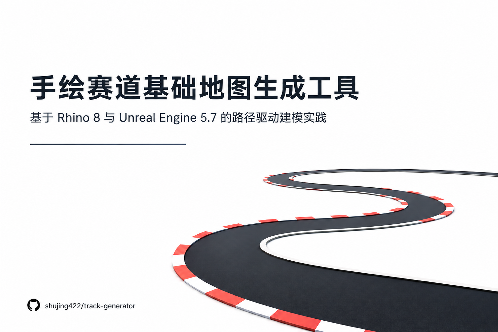
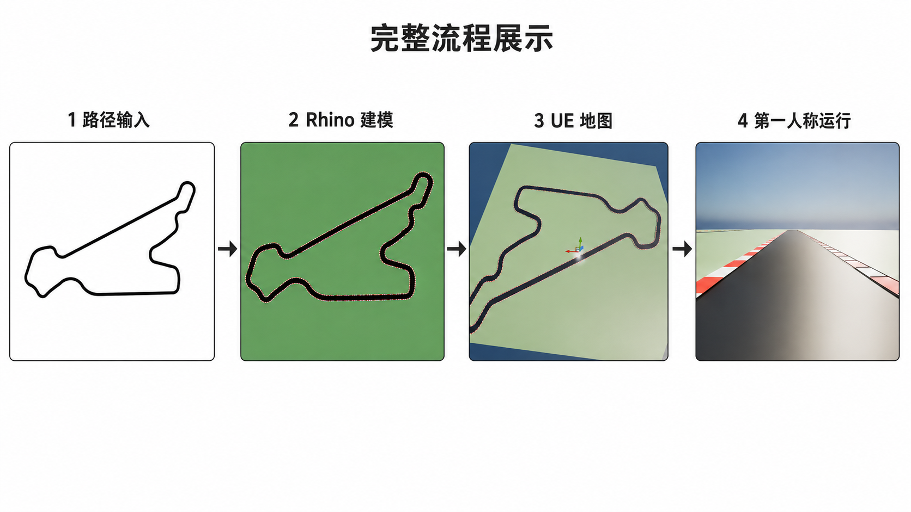
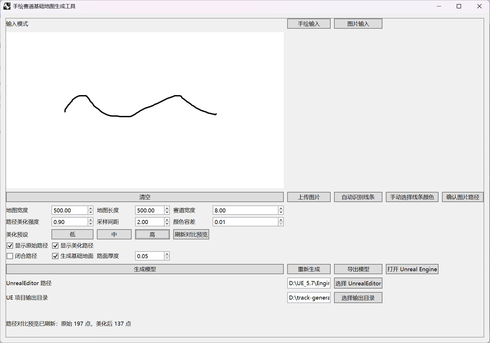
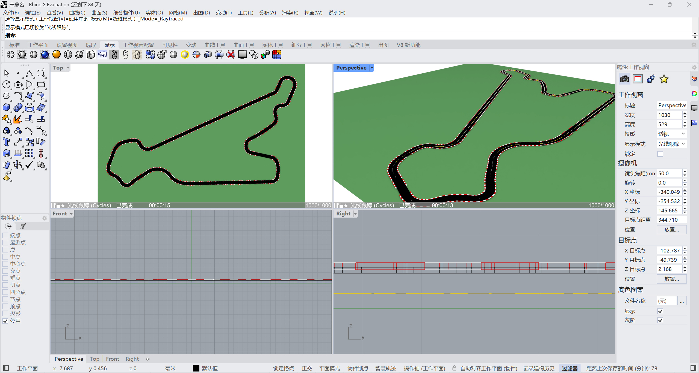
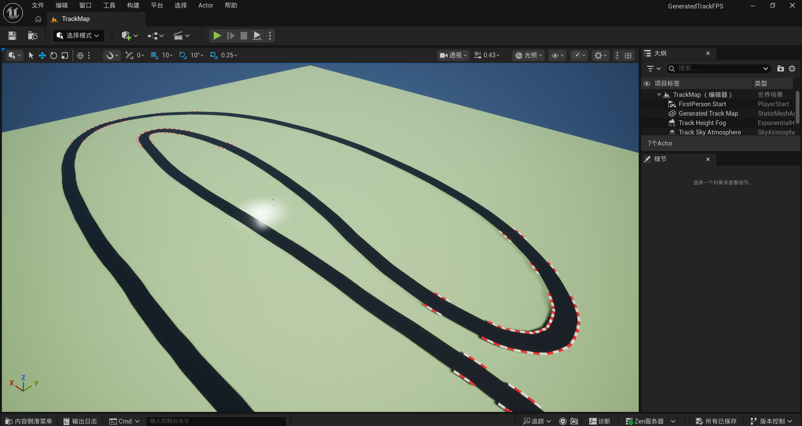
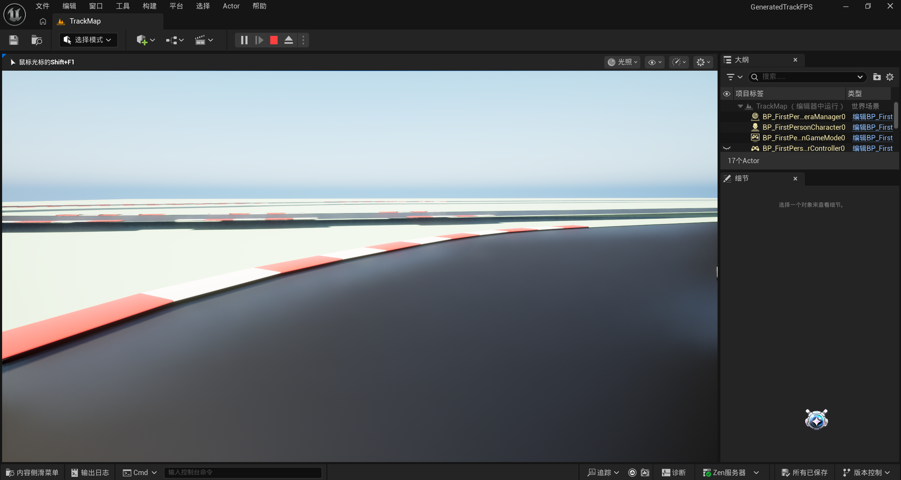
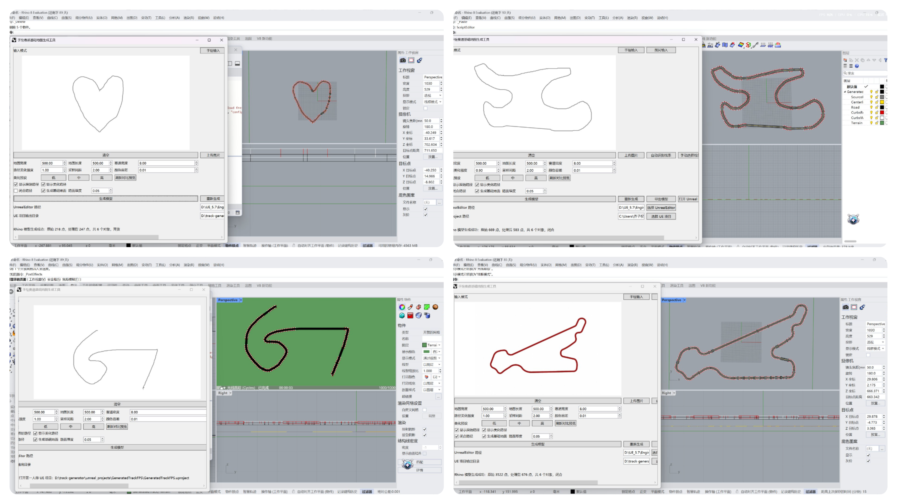

# Rhino 8 手绘赛道基础地图生成工具

<p align="center">
  <strong>将手绘路径或线条图片转换为 Rhino 赛道模型，并自动创建 Unreal Engine 第一人称地图项目。</strong>
</p>

<p align="center">
  
</p>

## 项目简介

本项目运行在 Rhino 8 内部。

用户可以直接在工具窗口中手绘路径，也可以从图片中识别一条主要线条。程序会对路径进行清理、重采样和平滑，并在 Rhino 中生成跑道、红白路肩和基础地形。

完成建模后，工具可以自动导出所需模型、创建独立的 Unreal Engine 第一人称项目、导入地图并启动编辑器。

## 完整流程

<p align="center">
  
</p>

```text
手绘路径或图片输入
        ↓
路径提取与处理
        ↓
Rhino 几何生成
        ↓
创建 Unreal Engine 项目
        ↓
导入地图并启动编辑器
```

## 主要功能

- 支持手绘路径和图片输入
- 支持 PNG、JPG、JPEG、BMP
- 支持图片线条自动识别和手动取色
- 自动清理、重采样和平滑路径
- 支持开放路径和闭合路径
- 自动生成跑道、红白路肩和基础地形
- 支持 OBJ 和 FBX 手动导出
- 自动创建 Unreal Engine 第一人称项目
- 自动完成 Rhino 到 Unreal Engine 的坐标转换
- 自动导入地图并添加基础光照、天空和默认关卡
- 自动启动 Unreal Engine 编辑器

## 工具界面

<p align="center">
  
</p>

工具界面集成了路径输入、图片识别、参数设置、模型生成、模型导出和 Unreal Engine 项目创建功能。

## 生成效果

### Rhino 模型

<p align="center">
  
</p>

### Unreal Engine 地图

<table>
  <tr>
    <td align="center" width="50%">
      
      <br>
      <sub>地图整体视图</sub>
    </td>
    <td align="center" width="50%">
      
      <br>
      <sub>第一人称运行效果</sub>
    </td>
  </tr>
</table>

## 不同路径案例

<p align="center">
  
</p>

## 环境要求

- Windows
- Rhino 8
- Rhino 8 ScriptEditor 的 Python 3
- Pillow
- Unreal Engine 5
- Unreal Engine 安装目录中存在 `Templates/TP_FirstPersonBP`

本项目不支持 Rhino 7 的 IronPython 2。

## 快速开始

### 1. 克隆仓库

```powershell
git clone https://github.com/shujing422/track-generator.git
cd track-generator
```

### 2. 安装 Pillow

在 Rhino 8 的 Python 3 ScriptEditor 中运行：

```python
import subprocess
import sys

subprocess.check_call([
    sys.executable,
    "-m",
    "pip",
    "install",
    "Pillow>=10,<12",
])
```

### 3. 启动工具

1. 打开 Rhino 8
2. 打开一个可写的 Rhino 文档
3. 打开 `ScriptEditor`
4. 选择 Python 3
5. 打开并运行：

```text
<repo-root>\main.py
```

## 使用方法

### 手绘输入

1. 点击“手绘输入”
2. 在画布中绘制一条路径
3. 设置地图尺寸、赛道宽度和其他参数
4. 选择开放路径或闭合路径
5. 点击“生成模型”
6. 配置 `UnrealEditor.exe`
7. 点击“打开 Unreal Engine”

### 图片输入

1. 点击“图片输入”
2. 点击“上传图片”
3. 选择 PNG、JPG、JPEG 或 BMP 文件
4. 点击“自动识别线条”
5. 检查识别结果
6. 识别不准确时，手动选择线条颜色并调整颜色容差
7. 点击“确认图片路径”
8. 设置地图尺寸、赛道宽度和其他参数
9. 点击“生成模型”
10. 配置 `UnrealEditor.exe`
11. 点击“打开 Unreal Engine”

工具会自动导出所需模型、创建 Unreal Engine 项目、导入地图并启动编辑器。

需要单独保存模型时，也可以使用“导出模型”功能，将结果导出为 OBJ 或 FBX。

## 项目结构

```text
<repo-root>
├─ main.py
├─ config.example.json
├─ config.py
├─ ui/
├─ processing/
├─ geometry/
├─ rhino/
├─ export/
├─ images/
├─ model/
└─ tests/
```

## 自动测试

安装开发依赖：

```powershell
python -m pip install -r requirements.txt
```

运行测试：

```powershell
python -m pytest -q
python -m compileall -q .
```

## 已知限制

- 当前主要支持单条连续路径
- 多条线、大量分叉和严重自交可能无法正确处理
- 复杂背景、阴影和低对比度图片可能影响线条识别
- 图片识别基于颜色和像素，不进行语义理解
- Unreal Engine 项目创建依赖第一人称模板
- 当前不包含车辆物理、计时系统和完整赛车玩法

## 开源协议

本项目基于 [MIT License](LICENSE) 开源。